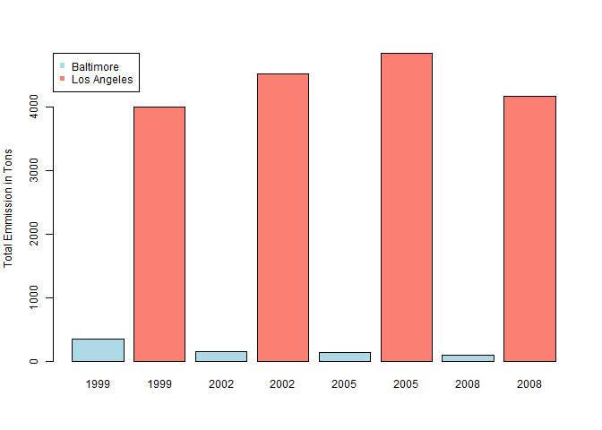
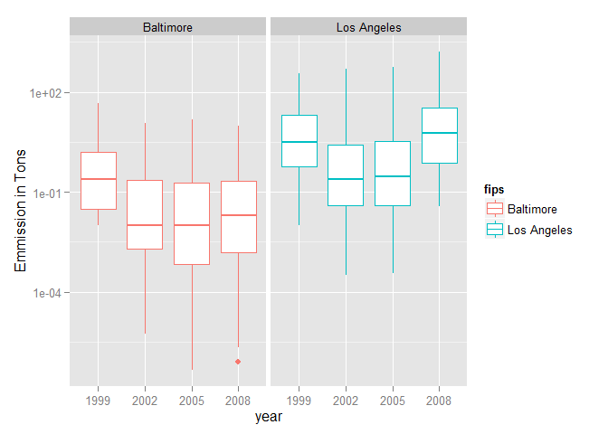
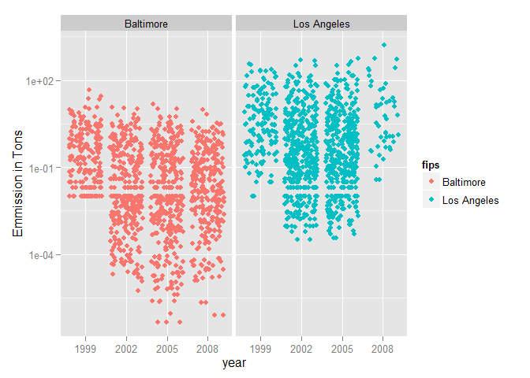
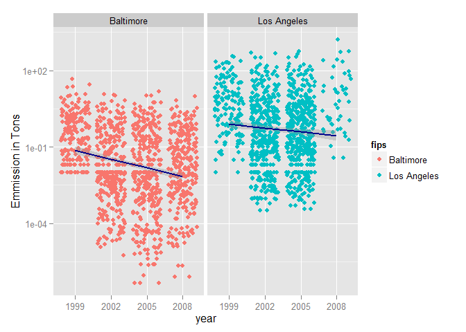

# Choosing the Appropriate Type of Charts to Summarize the Result
Lawrence Chen  
Tuesday, May 19, 2015  

## Synopsis
It is important to choose the appropriate type of charts that best represent the
data and show the result of your analysis.  The wrong kind of chart can lead
you and your readers to the wrong conclusion.  After collecting and processing
the data for your study, it is often a good idea to try to explore different
dimensions and with different types of chart. Sometimes, the results can be
surprising.  This article illustrates one of those surprising examples.

## Loading and processing data
This example uses National Emissions Inventory (NEI) database[[1]](http://www.epa.gov/ttn/chief/eiinformation.html).
A subset of data represents PM2.5 emissions from a variety of sources in
the United States in 1999, 2002, 2005, and 2008 is used for this demonstration.


```r
url <- 'https://d396qusza40orc.cloudfront.net/exdata%2Fdata%2FNEI_data.zip'
filename <- 'exdata-data-NEI_data.zip'

if (!file.exists(filename)) {
    download.file(url = url, destfile = filename)
    unzip(filename)
}


library(data.table)
```

```
## 
## Attaching package: 'data.table'
## 
## The following object is masked _by_ '.GlobalEnv':
## 
##     .N
```

```r
NEI <- as.data.table(readRDS("summarySCC_PM25.rds"))
NEI$Pollutant <- NULL

dim(NEI)
```

```
## [1] 6497651       5
```

```r
colnames(NEI)
```

```
## [1] "fips"      "SCC"       "Emissions" "type"      "year"
```

```r
SCC <- as.data.table(readRDS("Source_Classification_Code.rds"))

dim(NEI)
```

```
## [1] 6497651       5
```

```r
colnames(SCC)
```

```
##  [1] "SCC"                 "Data.Category"       "Short.Name"         
##  [4] "EI.Sector"           "Option.Group"        "Option.Set"         
##  [7] "SCC.Level.One"       "SCC.Level.Two"       "SCC.Level.Three"    
## [10] "SCC.Level.Four"      "Map.To"              "Last.Inventory.Year"
## [13] "Created_Date"        "Revised_Date"        "Usage.Notes"
```


```r
library(data.table)

#Baltimore County; BC = 24510
#Los Angeles County; LA = 06037
pm25 <- NEI[fips %in% c('24510', '06037')]
pm25[fips == '24510', fips:='Baltimore']
pm25[fips == '06037', fips:='Los Angeles']

pm25 <- merge(pm25, SCC, by = 'SCC')

pm25[, year:=as.factor(year)]

motov <- grepl('(Motor|Veh)', pm25$Short.Name)
```

## Question
Comparing emissions from motor vehicle sources in Baltimore City (FIPS 24510)
Maryland with emissions from motor vehicle sources in Los Angeles County
(FIPS 06037) California, which city has seen greater changes over time in motor
vehicle emissions?

To answer this question, you might be thinking of comparing total PM2.5
emissions like this:


```r
df <- with(pm25[motov],
           aggregate(Emissions, by = list(fips, year), sum))

colnames(df) <- c('County', 'Year', 'Emmission')

par(cex = 0.75)

barplot(df$Emmission, names.arg = df$Year,
        col=c("lightblue","salmon"), beside=T,
        ylab = 'Total Emmission in Tons')

legend('topleft', legend=unique(df$County),
       pch = 15, col=c("lightblue","salmon"))
```

 

This chart might be okay except Los Angeles has far higher number of observations
(data points):


```
##   Baltimore Los Angeles 
##        2096        9320
```

Let's try instead using a boxplot to compare the average emission:


```r
library(ggplot2)

qplot(year, Emissions, data = pm25[motov],
      geom = 'boxplot',
      facets = .~fips,
      color = fips,
      log  = 'y',
      ylab = 'Emmission in Tons')
```

 

That's better. This is a more telling chart showing what was happening between
the two counties.

### Except there is a surprising twist.

I showed earlier that, in this data set, Los Angeles County had more than 4
times of PM2.5 measurements than Baltimore County.

Let's try a stipplot this time:


```r
library(ggplot2)

qplot(year, Emissions, data = pm25[motov],
      geom = 'jitter',
      facets = .~fips,
      color = fips,
      log  = 'y',
      ylab = 'Emmission in Tons')
```

 

Better! Surprisingly the number of motor vehicle emission sources in Los Angeles
County dropped sharply between 2005 and 2008.

For the final touch, let's complete the picture by fitting the data point
though linear regression.


```r
library(ggplot2)

qplot(year, Emissions, data = pm25[motov],
      geom = 'jitter',
      facets = .~fips,
      color = fips,
      log  = 'y',
      ylab = 'Emmission in Tons') +
    geom_smooth(aes(group = 1), size = 1,
                method = "lm", se = T,
                color = 'darkblue')
```

 

## Final Analysis

Remember to try to explore your data using a variety of ways early in your analysis
before diving into deep statistical analysis.  You might find something surprising
in your data set that could lead you to reformulate your original hypothesis and
thus saving you countless hours later.

***

If you like this article, please share it with your friends or colleagues.

I can be reached at <https://www.linkedin.com/in/lawrence009>.

