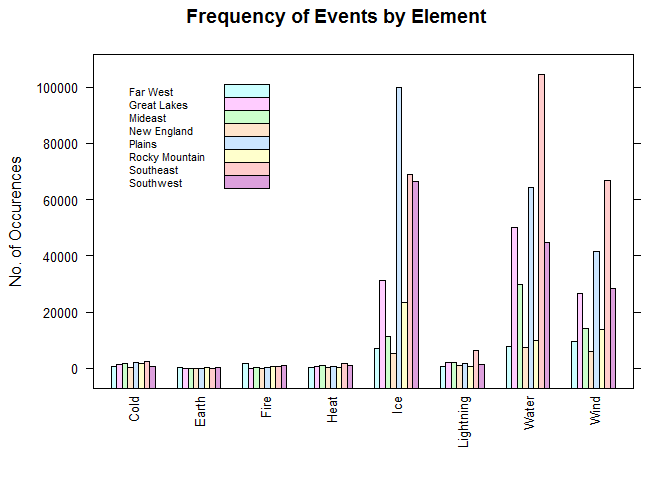
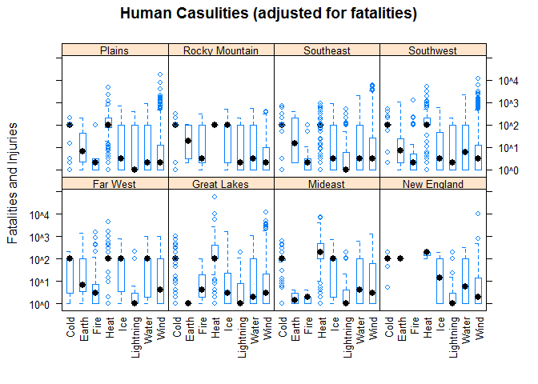
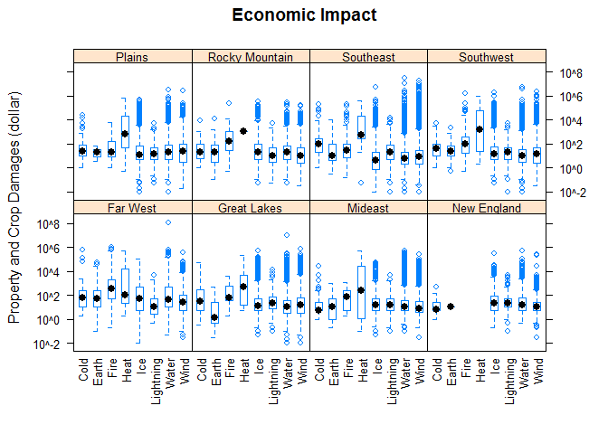

# Impact of Severe Weather Events Across the United States between 1950 and 2011
Lawrence C. Chen  
Friday, May 23, 2015  

# Synopsis

Although destructive weather events like [Hurricane Katrina](http://en.wikipedia.org/wiki/Hurricane_Katrina)
and the [Great Flood of 1993](http://en.wikipedia.org/wiki/Great_Flood_of_1993)
are infrequent, their resulting impact to the population health and damage to
the economy lasted months to years. A significant root causes that made the
impact of these events far worse can be attributed to the lack of preparation
and anticipation.

Analyzing records between 1950 and 2011 recorded in the [NOAA Storm Database](http://www.ncdc.noaa.gov/stormevents/ftp.jsp),
states in the Southeast and Southwest regions are most susceptible to weather
events commonly associated with wind and water elements such as hurricane, storm
and and flood, next by weather event associated with ice elements such as heavy
snow.  However, it is extreme weather events associated to high temperature and
drought (element heat) that most commonly lead to significant population/crop
damage and are most harmful to population health.


# Loading and preprocessing the raw data


```r
url <- 'https://d396qusza40orc.cloudfront.net/repdata%2Fdata%2FStormData.csv.bz2'
filename <- 'repdata-data-StormData.csv.bz2'

#check if the data file is available
if (!file.exists(filename)) {
    download.file(url = url, destfile = filename)
}

sample <- read.csv(filename, nrows = 100)

colClasses <- vapply(sample, class, 'character')
ch <- grep('(logical|integer|factor)', colClasses)
colClasses[ch] <- 'character'
```


```r
library(data.table)

dts <- as.data.table(read.csv(filename, na.strings = '', colClasses = colClasses))
```

This data set consists of 902297 observations and 37
variables.  The first 6 rows of the data are as below:


```
##    STATE__           BGN_DATE BGN_TIME TIME_ZONE COUNTY COUNTYNAME STATE
## 1:       1  4/18/1950 0:00:00     0130       CST     97     MOBILE    AL
## 2:       1  4/18/1950 0:00:00     0145       CST      3    BALDWIN    AL
## 3:       1  2/20/1951 0:00:00     1600       CST     57    FAYETTE    AL
## 4:       1   6/8/1951 0:00:00     0900       CST     89    MADISON    AL
## 5:       1 11/15/1951 0:00:00     1500       CST     43    CULLMAN    AL
## 6:       1 11/15/1951 0:00:00     2000       CST     77 LAUDERDALE    AL
##     EVTYPE BGN_RANGE BGN_AZI BGN_LOCATI END_DATE END_TIME COUNTY_END
## 1: TORNADO         0      NA         NA       NA       NA          0
## 2: TORNADO         0      NA         NA       NA       NA          0
## 3: TORNADO         0      NA         NA       NA       NA          0
## 4: TORNADO         0      NA         NA       NA       NA          0
## 5: TORNADO         0      NA         NA       NA       NA          0
## 6: TORNADO         0      NA         NA       NA       NA          0
##    COUNTYENDN END_RANGE END_AZI END_LOCATI LENGTH WIDTH F MAG FATALITIES
## 1:         NA         0      NA         NA   14.0   100 3   0          0
## 2:         NA         0      NA         NA    2.0   150 2   0          0
## 3:         NA         0      NA         NA    0.1   123 2   0          0
## 4:         NA         0      NA         NA    0.0   100 2   0          0
## 5:         NA         0      NA         NA    0.0   150 2   0          0
## 6:         NA         0      NA         NA    1.5   177 2   0          0
##    INJURIES PROPDMG PROPDMGEXP CROPDMG CROPDMGEXP WFO STATEOFFIC ZONENAMES
## 1:       15    25.0          K       0         NA  NA         NA        NA
## 2:        0     2.5          K       0         NA  NA         NA        NA
## 3:        2    25.0          K       0         NA  NA         NA        NA
## 4:        2     2.5          K       0         NA  NA         NA        NA
## 5:        2     2.5          K       0         NA  NA         NA        NA
## 6:        6     2.5          K       0         NA  NA         NA        NA
##    LATITUDE LONGITUDE LATITUDE_E LONGITUDE_ REMARKS REFNUM
## 1:     3040      8812       3051       8806      NA      1
## 2:     3042      8755          0          0      NA      2
## 3:     3340      8742          0          0      NA      3
## 4:     3458      8626          0          0      NA      4
## 5:     3412      8642          0          0      NA      5
## 6:     3450      8748          0          0      NA      6
```

Columns crucial to the analysis are:

* STATE (2-letter state designation, including the US Territories)
* BGN_DATE (date which the event occurred)
* EVTYPE (type of event)
* FATALITIES (no. of human fatalities)
* INJURIES (no. of human injuries)
* PROPDMG (dollar amount of property damage)
* PROPDMGEXP (magnitude of amount in thousand (K), million (M), or billion (B))
* CROPDMG (dollar amount of crop damage)
* CROPDMGEXP (magnitude of amount in thousand (K), million (M), or billion (B))

## Data cleansing

```r
library(data.table)

setnames(dts, c(1, 35), c('STATE_FIPS', 'LONGITUDE_E'))

dts[, ':='(STATE_FIPS =as.integer(STATE_FIPS),
           BGN_DATE   =as.IDate(BGN_DATE, '%m/%d/%Y'),
           EVTYPE     =tolower(EVTYPE),           
           REFNUM     =as.integer(REFNUM))]

obs.total <- dim(dts)[1]
obs.dmg <- dim(dts[PROPDMG > 0 | CROPDMG > 0])[1]
obs.badexp <- dts[PROPDMG > 0 | CROPDMG > 0,
                  sum((!grepl('[KMBkmb]', PROPDMGEXP) |
                           !grepl('[KBMkbm]', CROPDMGEXP)))]
```

Of 902297 total observations (obs), 245031 obs. contain property or
crop damage estimates.  However, 60.95 percent
of which do not have the proper magnitude designations: K, M or B. In those
instances, thousand (K) is assumed. If magnitude is specified as one of the number
between 1 to 9, the number is used as the exponent of 10.

### Adjusting property and crop damages


```r
dmgAmt <- function(value, magnitude = 'K') {
    #returns dollar value in mulitple of thousands.
    #If magnitude is not one of 'K', 'M' or 'B', assume 'K'.

    #assumes value and magnitude are both equal length

    val <- numeric(length(value))

    for (i in 1:length(value)) {
        mag <- toupper(magnitude[i])
        
        if (grepl('[1-9]', mag)) {
            val[i] <- value[i] * 10^(as.numeric(mag) - 3)
        } else if (!grepl('[MB]', mag) | is.na(mag)) {
            val[i] <- value[i]
        } else if (mag == 'M') {
            val[i] <- value[i] * 1e3
        } else if (mag == 'B') {
            val[i] <- value[i] * 1e6
        }
    }

    val
}

dts[PROPDMG > 0, PropDmg:=dmgAmt(PROPDMG, PROPDMGEXP)]

dts[CROPDMG > 0, CropDmg:=dmgAmt(CROPDMG, CROPDMGEXP)]

dts[is.na(PropDmg), PropDmg:=0]
dts[is.na(CropDmg), CropDmg:=0]
```

### Summary from adjusting the affected damage estimates


```r
bad.propexp <- dts[, PROPDMG > 0 & grepl('[^KBMkmb]', PROPDMGEXP)]

bad.cropexp <- dts[, CROPDMG > 0 & grepl('[^KMBkmb]', CROPDMGEXP)]

propdmg <- dts[bad.propexp, .(PROPDMG=sum(PROPDMG),
                              PropDmg=sum(PropDmg))]
cropdmg <- dts[bad.cropexp, .(CROPDMG=sum(CROPDMG),
                              CropDmg=sum(CropDmg))]

dmg.summary <- cbind(t(propdmg), t(cropdmg))
colnames(dmg.summary) <- c('Properties', 'Crops')
rownames(dmg.summary) <- c('Original', 'Adjusted')

dmg.summary
```

```
##          Properties Crops
## Original     7671.3   260
## Adjusted   913483.5   260
```

The adjustment resulted in 119-fold
improvement in property damage estimates, or $906
billions.


### Summary of damage estimates by states


```r
dmg.summary <- dts[, .('Prop Damage'=sum(PropDmg, na.rm = T),
                       'Crop Damage'=sum(CropDmg, na.rm = T),
                       Injuries=sum(INJURIES, na.rm = T),
                       Fatalitites=sum(FATALITIES, na.rm = T)),
                   by = STATE]

zero.dmg <- which(rowSums(dmg.summary[, c(2:5), with=F]) == 0)

head(dmg.summary)
```

```
##    STATE Prop Damage Crop Damage Injuries Fatalitites
## 1:    AL  17241461.9    606769.2     8742         784
## 2:    AZ   3746369.7    214161.0      968         208
## 3:    AR   4382306.4    174790.0     5550         530
## 4:    CA 123587811.1   3528051.8     3278         550
## 5:    CO   2702764.3    190708.9     1004         163
## 6:    CT    761631.9        30.0      897          41
```

And those states have no reported human injuries, fatalities, property or crop
damages are: ST, LC, LH, PM, XX

### 2005 New Year's Eve Napa Valley Flood
The initial data exploration revealed that property and crop damage estimates of
the flood in Napa 2006 (REFNUM 605943) were erroneous by several order of
magnitude.


```r
#REFNUM 605943 original estimates
dts[REFNUM == 605943, c('PROPDMG', 'PROPDMGEXP', 'CROPDMG', 'CROPDMGEXP'), with=F]
```

```
##    PROPDMG PROPDMGEXP CROPDMG CROPDMGEXP
## 1:     115          B    32.5          M
```

 These values were corrected using estimated located in this
[News Article](http://napavalleyregister.com/news/local/napa-flood-damage-estimate-drops-to-million/article_bc2b3e27-1a7e-5886-ada4-6da209b4a5db.html 'Title'). 
[News footage](https://youtu.be/OQ5S86IAsn4) and additional information from
usgs.gov can be found [here](http://pubs.usgs.gov/of/2006/1182/pdf/ofr2006-1182.pdf).


```r
#REFNUM 605943 correction
dts[REFNUM == 605943, ':='(PROPDMG=13.75,
                           PROPDMGEXP='M',
                           CROPDMG=(114.2 - 13.75),
                           CROPDMGEXP='M')]
```


## Dimensionality reduction (feature extraction) of EVTYPE


```r
# Permitted Storm Data Events
evlist <- read.csv('EventTable.csv', na.strings='')

# Event types from the data set
evtype <- sort(dts[, unique(EVTYPE)])

head(evtype, 30)
```

```
##  [1] "   high surf advisory"          " coastal flood"                
##  [3] " flash flood"                   " lightning"                    
##  [5] " tstm wind"                     " tstm wind (g45)"              
##  [7] " waterspout"                    " wind"                         
##  [9] "?"                              "abnormal warmth"               
## [11] "abnormally dry"                 "abnormally wet"                
## [13] "accumulated snowfall"           "agricultural freeze"           
## [15] "apache county"                  "astronomical high tide"        
## [17] "astronomical low tide"          "avalance"                      
## [19] "avalanche"                      "beach erosin"                  
## [21] "beach erosion"                  "beach erosion/coastal flood"   
## [23] "beach flood"                    "below normal precipitation"    
## [25] "bitter wind chill"              "bitter wind chill temperatures"
## [27] "black ice"                      "blizzard"                      
## [29] "blizzard and extreme wind chil" "blizzard and heavy snow"
```

Many of the EVTYPE (event types; 898 total) in the data set do
not match the [official list](http://www.ncdc.noaa.gov/stormevents/pd01016005curr.pdf)
of 48 event names. Best attempt was applied to semi-manually
pattern-match EVTYPE to the official list of events.

```
## EVTYPE text pattern 
#VOLCANIC ASH
dts[grepl('^vo', EVTYPE), EVTYPE:='Volcanic Ash']

#HAIL
dts[grepl('^hail', EVTYPE), EVTYPE:='Hail']

#HIGH WIND
dts[grepl('^high wind', EVTYPE), EVTYPE:='High Wind']

#HURRICANE
dts[grepl('^hurricane', EVTYPE), EVTYPE:='Hurricane (Typhoon)']
```
... however matching EVTYPE and maintaining the code this way gets tedious quickly.
A pragmatic alternative is to alphabetically sort and save the list
unique EVTYPE to a csv file first.


```r
write.table(sort(unique(dts$EVTYPE)),
            'foobar.csv', sep =',', col.names = c('EVTYPE'), row.names = F)
```

Then the official names of events are assigned to the adjacent column to produce
the a EVTYPE-to-EventName mapping file found [here](https://github.com/lawrence009/datasciencecoursera/blob/master/repdata/peer2/EventMapping.csv) and
[here](https://github.com/lawrence009/datasciencecoursera/blob/master/repdata/peer2/EventTable.csv).


```r
evmap <- read.csv('EventMapping.csv', na.strings = '', colClasses = 'character')[2:3]

#fraction of EVTYPE that is not mapped
sum(is.na(evmap)) / length(evtype)
```

```
## [1] 0.3106904
```

```r
#append the official event name
dts <- merge(dts, evmap, by = 'EVTYPE', all.x = T)

head(dts[, c('EVTYPE', 'EventName'), with=F])
```

```
##                   EVTYPE     EventName
## 1:    high surf advisory     High Surf
## 2:         coastal flood Coastal Flood
## 3:           flash flood   Flash Flood
## 4:             lightning     Lightning
## 5:             tstm wind       Tsunami
## 6:             tstm wind       Tsunami
```

Where ambiguous, EVTYPE is cross-reference against REMARKS.


```r
## EVTYPE is summary...

#HUNDERSTORM WIND
dts[grepl('^summary', EVTYPE) & grepl('[Tt]hunderstorm.*[Ww]ind', REMARKS), EventName:='Thunderstorm Wind']

#HAIL
dts[grepl('^summary', EVTYPE) & grepl('[Hh]ail', REMARKS), EventName:='Hail']

#FLASH FLOOD
dts[grepl('^summary', EVTYPE) & grepl('[Ff]lash flood', REMARKS), EventName:='Flood']

#LIGHTNING
dts[grepl('^summary', EVTYPE) & grepl('[Ll]ightning', REMARKS), EventName:='Lightning']

#BLIZZARD
dts[grepl('^summary', EVTYPE) & grepl('[Bb]lizzard', REMARKS), EventName:='Blizzard']
```


### Assessment of EVTYPE extraction (map and replace) to EventName


```r
sum(is.na(dts$EventName)) / length(dts$EventName)
```

```
## [1] 0.01500282
```

```r
dmg.notmapped <- dts[is.na(EventName),
                    .(fatalities=sum(FATALITIES),
                      injuries=sum(INJURIES),
                      proddmg=sum(PropDmg),
                      cropdmg=sum(CropDmg))]


dmg.mapped <- dts[!is.na(EventName),
                  .(fatalities=sum(FATALITIES),
                    injuries=sum(INJURIES),
                    proddmg=sum(PropDmg),
                    cropdmg=sum(CropDmg))]


dmg.summary <- as.matrix(rbind(dmg.mapped, dmg.notmapped))
rownames(dmg.summary) <- c('mapped', 'not mapped')

dmg.summary
```

```
##            fatalities injuries     proddmg    cropdmg
## mapped          14831   139346 427949144.4 48424505.5
## not mapped        314     1182    283508.6   679957.4
```

```r
dmg.notmapped / dmg.mapped
```

```
##    fatalities    injuries      proddmg   cropdmg
## 1: 0.02117187 0.008482482 0.0006624821 0.0140416
```

**Conclusion:** The process is effective even though only 31
percent of the EVTYPE is mapped.

### Key weather elements

Weather events can also be further reduced using 8
key weather elements to enhance the analysis: Cold, Earth, Fire, Heat, Ice, Lightning, Water, Wind.


```r
summary(evlist) # list of official event names and the associated key elements
```

```
##                  EventName     Element1   Element2 
##  Astronomical Low Tide: 1   Wind   :12   Air  : 3  
##  Avalanche            : 1   Ice    :11   Earth: 1  
##  Blizzard             : 1   Water  :11   Fire : 1  
##  Coastal Flood        : 1   Cold   : 4   Water: 2  
##  Cold/Wind Chill      : 1   Earth  : 4   Wind : 2  
##  Debris Flow          : 1   Heat   : 3   NA's :39  
##  (Other)              :42   (Other): 3
```

```r
dts <- merge(dts, evlist, by = 'EventName', all.x = T)

summary(dts[, c('EVTYPE', 'EventName', 'Element1', 'Element2'), with=F])
```

```
##     EVTYPE                      EventName           Element1     
##  Length:902297      Hail             :288873   Water    :321591  
##  Class :character   Tsunami          :221077   Ice      :313738  
##  Mode  :character   Thunderstorm Wind:104385   Wind     :215609  
##                     Tornado          : 60688   Lightning: 15783  
##                     Flash Flood      : 55675   Cold     : 10899  
##                     (Other)          :158014   (Other)  : 11092  
##                     NA's             : 13585   NA's     : 13585  
##   Element2     
##  Air  :  4460  
##  Earth:   648  
##  Fire :    21  
##  Water:289411  
##  Wind :   580  
##  NA's :607177  
## 
```

The majority of the weather events are linked to key weather elements: water, ice and wind. 

### Bureau of Economic Analysis (BEA)
When comparing economic data, BEA further defines the states in the US into
[8 regions](http://bea.gov/regional/docs/regions.cfm):

1. New England
2. Mideast
3. Great Lakes
4. Plains
5. Southeast
6. Southwest
7. Rocky Mountain
8. Far West

The region-to-state mapping extracted from BEA can be found [here](https://github.com/lawrence009/datasciencecoursera/blob/master/repdata/peer2/BureauOfEconomicAnalysisRegions.csv).


```r
regions <- read.csv('BureauOfEconomicAnalysisRegions.csv')[c(3, 1)]
colnames(regions)[1] <- 'STATE'

summary(regions)
```

```
##      STATE            Region  
##  AK     : 1   Southeast  :12  
##  AL     : 1   Plains     : 7  
##  AR     : 1   Far West   : 6  
##  AZ     : 1   Mideast    : 6  
##  CA     : 1   New England: 6  
##  CO     : 1   Great Lakes: 5  
##  (Other):45   (Other)    : 9
```

```r
dts <- merge(dts, regions, by = 'STATE', all.x = T)

summary(dts[, c('STATE', 'Region'), with=F])
```

```
##      STATE                Region      
##  TX     : 83728   Southeast  :253317  
##  KS     : 53440   Plains     :210396  
##  OK     : 46802   Southwest  :143815  
##  MO     : 35648   Great Lakes:112607  
##  IA     : 31069   Mideast    : 61894  
##  (Other):632936   (Other)    :101594  
##  NA's   : 18674   NA's       : 18674
```

# Results

Weather events reported between 1950 and 2011 from the NOAA Storm Database were analyzed for the frequencies of the types of event and the portion of the those
event actually resulted in either human fatalities, injuries, property damages,
or corp damages.  The frequencies were further subdivided into regions and sorted
by event frequencies to aid prioritizing emergency resource and preparation.

Assessments of human causalities and economy impact by region and primary
weather elements were presented next.  A causality multiplier (lamda = 100) was
applied to the fatality figures (1 fatality = 100 injuries) when assessing impact
to population health.

## Event frequencies

States in the Southeast regions are most likely to be susceptible to weather
event linked to wind, water or ice.  States in the Plains were most susceptible
to events linked to ice.


```r
colnames(dts)
```

```
##  [1] "STATE"       "EventName"   "EVTYPE"      "STATE_FIPS"  "BGN_DATE"   
##  [6] "BGN_TIME"    "TIME_ZONE"   "COUNTY"      "COUNTYNAME"  "BGN_RANGE"  
## [11] "BGN_AZI"     "BGN_LOCATI"  "END_DATE"    "END_TIME"    "COUNTY_END" 
## [16] "COUNTYENDN"  "END_RANGE"   "END_AZI"     "END_LOCATI"  "LENGTH"     
## [21] "WIDTH"       "F"           "MAG"         "FATALITIES"  "INJURIES"   
## [26] "PROPDMG"     "PROPDMGEXP"  "CROPDMG"     "CROPDMGEXP"  "WFO"        
## [31] "STATEOFFIC"  "ZONENAMES"   "LATITUDE"    "LONGITUDE"   "LATITUDE_E" 
## [36] "LONGITUDE_E" "REMARKS"     "REFNUM"      "PropDmg"     "CropDmg"    
## [41] "Element1"    "Element2"    "Region"
```

```r
dts <- dts[, c(1:2, 5, 24:29, 38:43), with=F]

colnames(dts)
```

```
##  [1] "STATE"      "EventName"  "BGN_DATE"   "FATALITIES" "INJURIES"  
##  [6] "PROPDMG"    "PROPDMGEXP" "CROPDMG"    "CROPDMGEXP" "REFNUM"    
## [11] "PropDmg"    "CropDmg"    "Element1"   "Element2"   "Region"
```

```r
library(reshape2)
library(lattice)

dt1 <- table(dts[, c('Region', 'Element1'), with=F])
dt1 <- melt(dt1)

poly.colors <- trellis.par.get("superpose.polygon")$col
poly.colors <- c(poly.colors, 'plum')

barchart(value ~ Element1, data = dt1,
         main = 'Frequency of Events by Element',
         groups = Region,
         beside = T,
         ylab = 'No. of Occurences',
         scales=list(x=list(rot = 90)),
         auto.key=list(x = .05, y=.6, corner = c(0, 0), cex = 0.7),
         par.settings = list(superpose.polygon = list(col = poly.colors)))
```

 

## Frequencies of events with human fatalities by region


```r
library(knitr)

table(dts[(PropDmg + CropDmg) > 0, c('Region', 'Element1'), with=F]) -> dmg.freq
table(dts[FATALITIES > 0, c('Region', 'Element1'), with=F]) -> ftl.freq
table(dts[INJURIES   > 0, c('Region', 'Element1'), with=F]) -> inj.freq


freq.summary <- function(x) {
    # returns a data frame summarizing the frequency of element by region
    # x is a subset of dts that resembles y
    
    # distribution of event type by region
    y <- table(dts[, c('Region', 'Element1'), with=F])

    z <- merge(x, y, by=c('Region', 'Element1'))

    z$ratio <- z$Freq.x / z$Freq.y

    with(z, z[order(Region, -Freq.x, -ratio), ])
}


# percent of event with human fatalities
kable(freq.summary(ftl.freq), row.names = F, digits=2)
```


Region           Element1     Freq.x   Freq.y   ratio
---------------  ----------  -------  -------  ------
Far West         Water           206     7742    0.03
Far West         Ice             106     7040    0.02
Far West         Wind             96     9511    0.01
Far West         Heat             86      388    0.22
Far West         Cold             16      647    0.02
Far West         Lightning        15      500    0.03
Far West         Fire             13     1562    0.01
Far West         Earth             9      362    0.02
Great Lakes      Wind            338    26588    0.01
Great Lakes      Water           235    50030    0.00
Great Lakes      Cold            135     1352    0.10
Great Lakes      Heat            109      581    0.19
Great Lakes      Lightning        95     2050    0.05
Great Lakes      Ice              14    31159    0.00
Great Lakes      Fire              1       51    0.02
Great Lakes      Earth             0       23    0.00
Mideast          Water           247    29958    0.01
Mideast          Heat            134      899    0.15
Mideast          Wind            128    14304    0.01
Mideast          Lightning        65     2028    0.03
Mideast          Cold             38     1656    0.02
Mideast          Ice              24    11460    0.00
Mideast          Earth             0       22    0.00
Mideast          Fire              0      180    0.00
New England      Water            46     7523    0.01
New England      Wind             38     5923    0.01
New England      Lightning        20     1024    0.02
New England      Cold              8      459    0.02
New England      Ice               8     5191    0.00
New England      Heat              3      200    0.02
New England      Earth             1        7    0.14
New England      Fire              0        3    0.00
Plains           Wind            316    41418    0.01
Plains           Water           158    64250    0.00
Plains           Heat             98      630    0.16
Plains           Lightning        55     1668    0.03
Plains           Ice              51    99761    0.00
Plains           Cold             34     2026    0.02
Plains           Earth             1       11    0.09
Plains           Fire              1      157    0.01
Rocky Mountain   Ice             148    23249    0.01
Rocky Mountain   Lightning        87      796    0.11
Rocky Mountain   Water            49    10075    0.00
Rocky Mountain   Wind             49    13983    0.00
Rocky Mountain   Cold             13     1897    0.01
Rocky Mountain   Fire              7      658    0.01
Rocky Mountain   Earth             6      138    0.04
Rocky Mountain   Heat              1      213    0.00
Southeast        Wind            958    66844    0.01
Southeast        Water           804   104452    0.01
Southeast        Lightning       316     6230    0.05
Southeast        Heat            198     1754    0.11
Southeast        Cold             73     2367    0.03
Southeast        Ice              34    69074    0.00
Southeast        Earth             2       95    0.02
Southeast        Fire              2      602    0.00
Southwest        Water           297    44694    0.01
Southwest        Wind            261    28415    0.01
Southwest        Heat            169      890    0.19
Southwest        Lightning        97     1437    0.07
Southwest        Cold             37      495    0.07
Southwest        Ice              24    66304    0.00
Southwest        Fire             14     1004    0.01
Southwest        Earth             5      291    0.02

## Frequencies of events with human injuries by region


```r
# percent of event with human injuries
kable(freq.summary(inj.freq), row.names = F, digits=2)
```


Region           Element1     Freq.x   Freq.y   ratio
---------------  ----------  -------  -------  ------
Far West         Water           212     7742    0.03
Far West         Wind            185     9511    0.02
Far West         Fire            169     1562    0.11
Far West         Ice             104     7040    0.01
Far West         Lightning        81      500    0.16
Far West         Heat             26      388    0.07
Far West         Earth            25      362    0.07
Far West         Cold             13      647    0.02
Great Lakes      Wind           1459    26588    0.05
Great Lakes      Water           540    50030    0.01
Great Lakes      Lightning       341     2050    0.17
Great Lakes      Ice              59    31159    0.00
Great Lakes      Heat             36      581    0.06
Great Lakes      Cold             22     1352    0.02
Great Lakes      Fire              3       51    0.06
Great Lakes      Earth             1       23    0.04
Mideast          Wind            454    14304    0.03
Mideast          Water           415    29958    0.01
Mideast          Lightning       362     2028    0.18
Mideast          Heat             52      899    0.06
Mideast          Ice              35    11460    0.00
Mideast          Cold             18     1656    0.01
Mideast          Fire              8      180    0.04
Mideast          Earth             4       22    0.18
New England      Lightning       196     1024    0.19
New England      Wind            158     5923    0.03
New England      Water            67     7523    0.01
New England      Ice              10     5191    0.00
New England      Cold              4      459    0.01
New England      Earth             0        7    0.00
New England      Fire              0        3    0.00
New England      Heat              0      200    0.00
Plains           Wind           1486    41418    0.04
Plains           Water           445    64250    0.01
Plains           Lightning       168     1668    0.10
Plains           Ice             142    99761    0.00
Plains           Heat             60      630    0.10
Plains           Fire             11      157    0.07
Plains           Cold             11     2026    0.01
Plains           Earth             4       11    0.36
Rocky Mountain   Wind            256    13983    0.02
Rocky Mountain   Lightning       217      796    0.27
Rocky Mountain   Ice             147    23249    0.01
Rocky Mountain   Water           105    10075    0.01
Rocky Mountain   Fire             20      658    0.03
Rocky Mountain   Earth             9      138    0.07
Rocky Mountain   Cold              7     1897    0.00
Rocky Mountain   Heat              0      213    0.00
Southeast        Wind           3981    66844    0.06
Southeast        Water          1377   104452    0.01
Southeast        Lightning      1221     6230    0.20
Southeast        Ice              69    69074    0.00
Southeast        Heat             40     1754    0.02
Southeast        Fire             33      602    0.05
Southeast        Cold             11     2367    0.00
Southeast        Earth             3       95    0.03
Southwest        Wind           1397    28415    0.05
Southwest        Water           507    44694    0.01
Southwest        Lightning       220     1437    0.15
Southwest        Ice              82    66304    0.00
Southwest        Fire             71     1004    0.07
Southwest        Earth            22      291    0.08
Southwest        Heat             20      890    0.02
Southwest        Cold             13      495    0.03

## Frequencies of events with property or crop damages by region


```r
# percent of event with property or crop damage
kable(freq.summary(dmg.freq), row.names = F, digits=2)
```


Region           Element1     Freq.x   Freq.y   ratio
---------------  ----------  -------  -------  ------
Far West         Water          1929     7742    0.25
Far West         Wind           1781     9511    0.19
Far West         Ice             388     7040    0.06
Far West         Fire            321     1562    0.21
Far West         Lightning       204      500    0.41
Far West         Earth           139      362    0.38
Far West         Cold             30      647    0.05
Far West         Heat              7      388    0.02
Great Lakes      Water         16280    50030    0.33
Great Lakes      Wind          14979    26588    0.56
Great Lakes      Ice            2837    31159    0.09
Great Lakes      Lightning      1414     2050    0.69
Great Lakes      Cold             56     1352    0.04
Great Lakes      Fire             28       51    0.55
Great Lakes      Heat             25      581    0.04
Great Lakes      Earth            16       23    0.70
Mideast          Water          8814    29958    0.29
Mideast          Wind           8240    14304    0.58
Mideast          Ice            1495    11460    0.13
Mideast          Lightning      1091     2028    0.54
Mideast          Cold            131     1656    0.08
Mideast          Heat             28      899    0.03
Mideast          Earth            13       22    0.59
Mideast          Fire             12      180    0.07
New England      Wind           2817     5923    0.48
New England      Water          2373     7523    0.32
New England      Lightning       633     1024    0.62
New England      Ice             343     5191    0.07
New England      Cold            154      459    0.34
New England      Earth             1        7    0.14
New England      Fire              0        3    0.00
New England      Heat              0      200    0.00
Plains           Wind          16853    41418    0.41
Plains           Water         14606    64250    0.23
Plains           Ice           11253    99761    0.11
Plains           Lightning      1220     1668    0.73
Plains           Cold            103     2026    0.05
Plains           Heat             53      630    0.08
Plains           Fire             51      157    0.32
Plains           Earth             3       11    0.27
Rocky Mountain   Wind           2240    13983    0.16
Rocky Mountain   Water          1501    10075    0.15
Rocky Mountain   Ice             778    23249    0.03
Rocky Mountain   Lightning       355      796    0.45
Rocky Mountain   Fire            113      658    0.17
Rocky Mountain   Earth            50      138    0.36
Rocky Mountain   Cold             19     1897    0.01
Rocky Mountain   Heat              1      213    0.00
Southeast        Wind          43045    66844    0.64
Southeast        Water         37685   104452    0.36
Southeast        Ice            6838    69074    0.10
Southeast        Lightning      4333     6230    0.70
Southeast        Fire            161      602    0.27
Southeast        Cold             81     2367    0.03
Southeast        Heat             72     1754    0.04
Southeast        Earth            48       95    0.51
Southwest        Wind          12845    28415    0.45
Southwest        Water         12433    44694    0.28
Southwest        Ice            4926    66304    0.07
Southwest        Lightning      1086     1437    0.76
Southwest        Fire            410     1004    0.41
Southwest        Heat            144      890    0.16
Southwest        Cold             85      495    0.17
Southwest        Earth            65      291    0.22

## Impact to population health by weather elements and regions

Impact from heat was highest among all regions, followed by cold.


```r
library(lattice)

#casuality mulitplier
lamda <- 100

dts[, ':='(econ  =(PropDmg + CropDmg),
           humn  =(FATALITIES*lamda + INJURIES),
           year  =as.factor(year(BGN_DATE)),
           month =as.factor(month(BGN_DATE)))] -> dts #supress print; not copied

bwplot(humn~Element1 | Region , data = dts[humn > 0],
       par.strip.text = list(cex = 0.8),
       main = 'Human Casulities (adjusted for fatalities)',
       ylab = 'Fatalities and Injuries',
       scales = list(cex = 0.8,
                     x = list(rot = 90),
                     y = list(log = 10)))
```

 

## Impact to the economy by weather elements and regions

Except in Far West and New England states, heat on the average caused the most
economic damages.


```r
bwplot(econ~Element1 | Region, data = dts[econ > 0],
       par.strip.text = list(cex = 0.8),
       main = 'Economic Impact',
       ylab = 'Property and Crop Damages (dollar)',
       scales = list(cex = 0.8,
                     x = list(rot = 90),
                     y = list(log = 10)))
```

 

